# 构建第一个ANN模型
```flow
st=>start: 了解项目背景，明确要解决的问题
op1=>operation: 查看数据整体结构，说明字段的意义
op2=>operation: 读取数据，划分特征和标签
op3=>operation: 对特征进行labelencoder和onehotencoder
op4=>operation: 进行测试集和训练集的划分
op5=>operation: 对测试集和训练集的特征进行标准化
op6=>operation: 训练模型
op7=>operation: 验证模型效果
op8=>operation: 对模型进行参数优化
ed=>end: 预测新数据并得出结论

st->op1->op2->op3->op4->op5->op6->op7->op8->ed
```
# 项目背景说明
我们用到的数据集是银行对客户信息字段的统计，这些字段如下所示：
以下是这些字段的具体说明：
> RowNumber: 行号
> CustomerId: 用户id
> Surname: 姓氏
> CreditScore: 信用分 
> Geography: 所处的国家
> Gender: 性别
> Age: 年龄
> Tenure: 已停留的期数
> Balance: 余额
> NumOfProducts: 在银行所购买的产品数目 
> HasCrCard: 是否具有信用卡
> IsActiveMember: 是否是活跃用户
> EstimatedSalary: 估计的工资
> Exited: 是否离开

我们可以打开excel看看数据的前几条。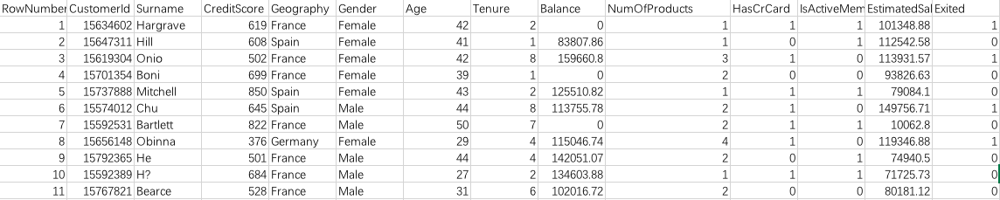 
发现既有分类变量，也有数值变量。因此这部分的分类变量之后可能要进行独热编码，数值变量需要进行标准化以免部分量级比较大的特征主导了模型的判断。
我们在这里想要解决的问题是，我们能否根据已有的用户特征去**预测用户可能的行为，包括离开银行以及不离开银行**。
这里根据我们的经验，有用的特征应该包括第三个特征CreditScore到EstimatedSalary等10个特征，而最后一列就是我们要预测的标签。
#读取数据，划分特征与标签

## 读取数据

接下来我们用pandas读取数据，并且取出数据值（用values的属性）

```python
#导入对应的工具包
import pandas as pd
import numpy as np
import matplotlib.pyplot as plt
%matplotlib inline
#读取数据
data=pd.read_csv('Churn_Modelling.csv')
data.head()
```

返回的结果

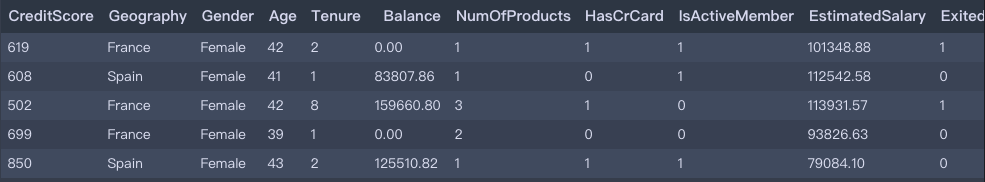

可以看到成功读取了数据。

## 划分特征字段和标签

我们取出对应的特征字段和标签字段。

```python
X=data.iloc[:, 3:13].values
y=data.iloc[:, 13].values
print (X[:5])
print (y[:5])
```

返回结果

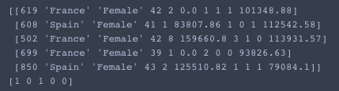

可以看到，已经成功取出了。

#对特征进行独热编码

关于为什么要对分类变量进行独热编码可以查看这篇文章[Why One-Hot Encode Data in Machine Learning?](https://machinelearningmastery.com/why-one-hot-encode-data-in-machine-learning/)

总结为以下几点：

1. 分类变量是指它里面的值都是处于一个有限的集合内的值，比如pet这个字段包含'dog'，'cat', 'bird'等。
2. 计算机输入的特征要用数值表示，输出也是一样。
3. 用数值来表示特征的方法有直接的数字表示(1,2,3,4)和独热编码one hot encoding，one hot encoding一般是一种二元0和1组成的一个向量，只有对应位置为相同位置的特征值才为1，其他位置都为0.数字表示的特征值之间有大小关系，而通常的分类变量之间并没有顺序关系，这会导致模型训练的性能差，而独热编码的向量没有这种顺序关系。

## labelencoder先将特征转化为数字表示
sklearn的[labelencoder](http://scikit-learn.org/stable/modules/generated/sklearn.preprocessing.LabelEncoder.html)可以将字符串的类转化成数字化的表示。
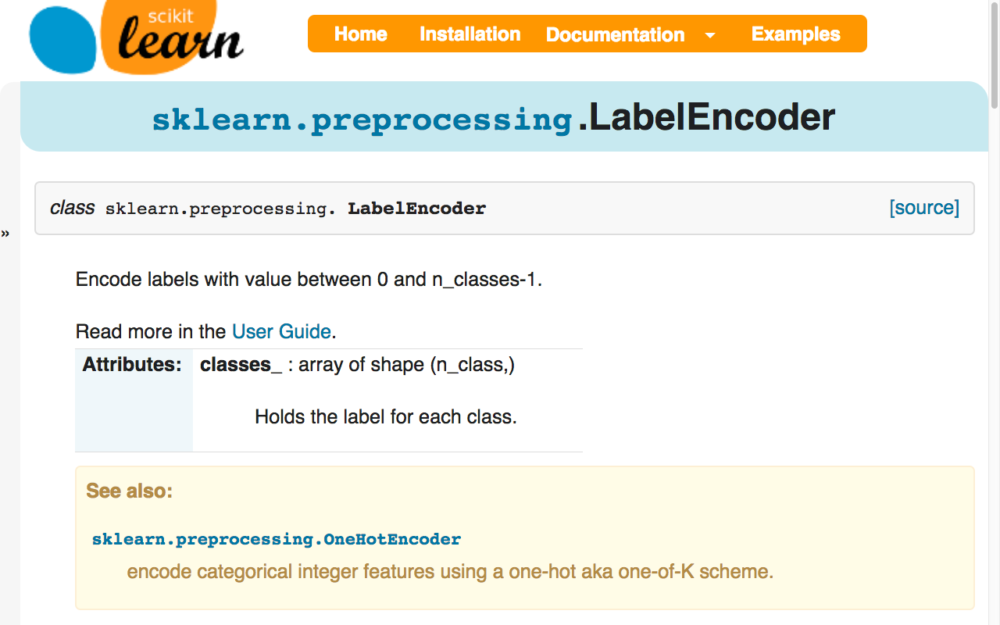

我们查看官方文档，查看功能，发现labelencoder的作用就是把文本的label转化成一串连续的数字。

具体用的方法也是一样的，新建一个模型实体，然后对数据集进行训练。我们分别对分类字段"Geography"还有"gender"进行转换。

```python
from sklearn.preprocessing import LabelEncoder
le1=LabelEncoder()
X[:, 1]=le1.fit_transform(X[:, 1])
le2=LabelEncoder()
X[:, 2]=le2.fit_transform(X[:, 2])
X[:5]
```

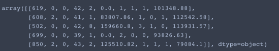

可以看到的确转化成功了。

## onehotencoder

我们先查看下sklearn的onehotencoder文档。

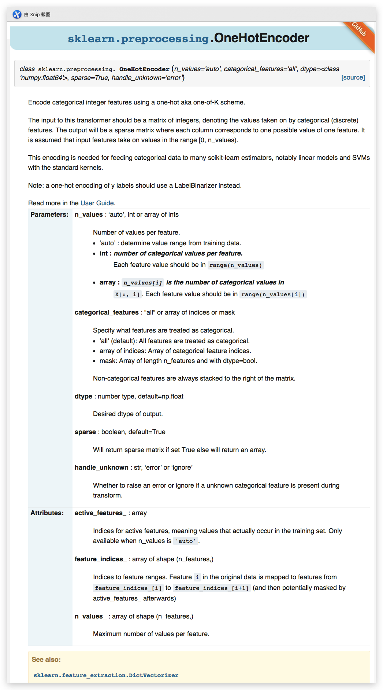

按照说明，它的功能是把数字型的特征转化为独热编码的特征。里面两个重要的参数分别是`n_values`还有`categorical_features`这两个特征。代表是有多少个不同的值，默认传入auto即可，`categorical_features`代表第几个位置的特征作为分类变量处理。

接下来我们要进行独热编码。在这里我们只需要对'Geography'这一个字段进行独热编码，因为'Gender'那一项其实是已经独热编码了(0和1)。

```python
from sklearn.preprocessing import OneHotEncoder
ec=OneHotEncoder(categorical_features=[1])#对应位置的索引是1
X=ec.fit_transform(X).toarray()#在转换之后得到的是稀疏矩阵，我们把它转换为矩阵
X[:5]
```

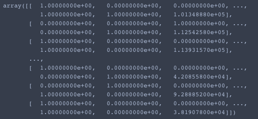

根据输出结果，我们发现已经转换成功了，并且转换之后，独热编码移动到了第一位。接下来我们为了避免dummy trap的问题，我们需要把第一列扔掉，只保留其他列。

```python
X=X[:, 1:]
X
```

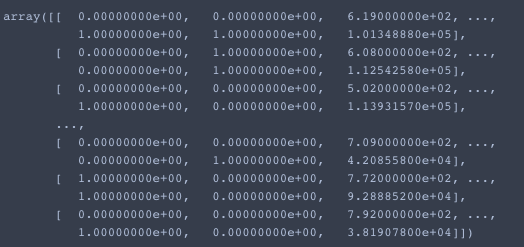


# 标准化缩放
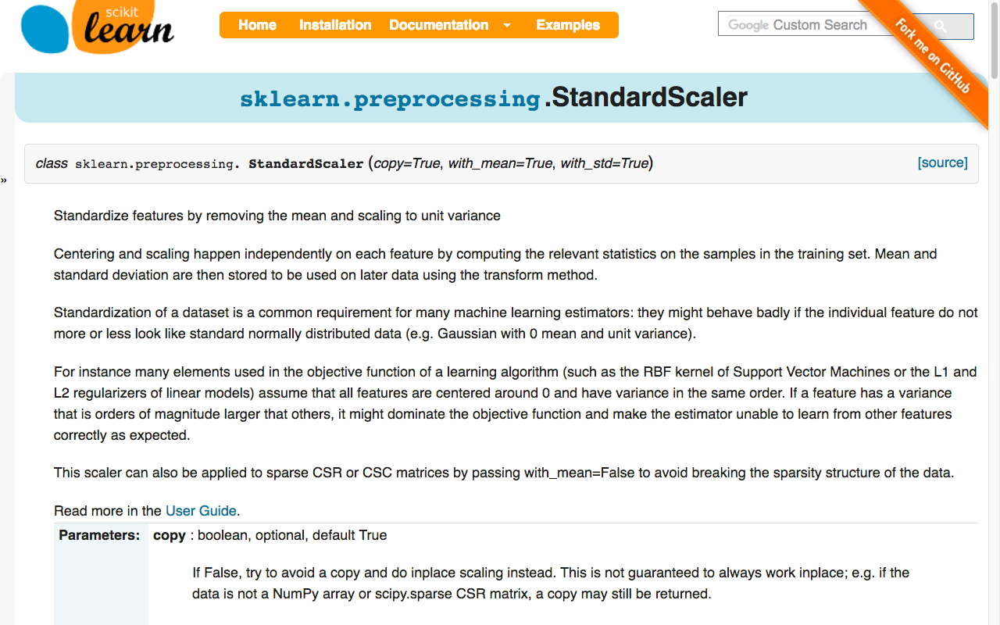
标准化缩放的作用是将特征的所有值都往均值为0的中心的方向平移，并且将方差进行标准化为单位方差，否则量级过大的方差会对目标函数造成主导，从而使目标函数无法对其他的特征进行学习。

我们用到的是sklearn的standardscaler。它的功能是把特征值的平均值移除，并且缩放到单位方差的数值，这样做的好处是可以让特征处于同一个量级上，不会有过大量级的特征影响到模型。

```python
from sklearn.preprocessing import StandardScaler
sc=StandardScaler()
X=sc.fit_transform(X)
```

# 划分训练集和测试集

```python
from sklearn.cross_validation import train_test_split
X_train,X_test,y_train,y_test=train_test_split(X,y,test_size=0.2)
```

# 构建神经网络模型

在前面处理好数据以后，接下来我们需要构建神经网络模型。也就是组织好整个网络的架构，比如有什么层，层与层之间的连接等等。

步骤是：初始化模型，依次添加层

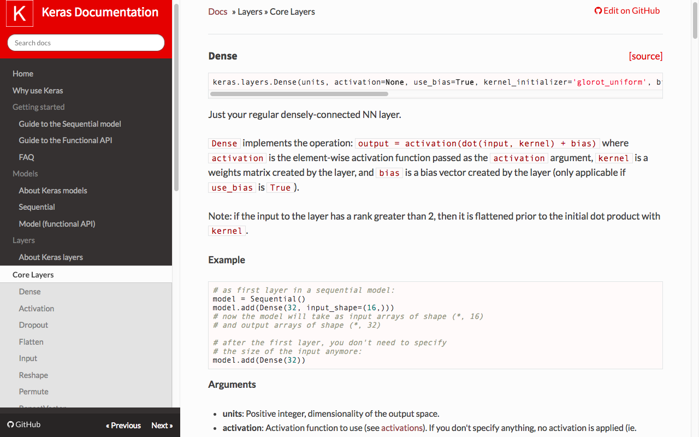

keras里面的紧密层有一些要传入的参数，包括units，它是输出的维度也是该层神经元的个数；activation，激活函数，经验一般隐含层用relu效果最好；kernel_initializer，初始化权重的方法，默认是glorot_uniform；以及如果是第一层的话，还需要指明输入的形状，input_shape。


```python
from keras.models import Sequential
from keras.layers import Dense#每一层的隐含层以及最后的输出层用的都是Dense这类层
from keras.layers import Dropout#我们添加新的Dropout层
classifier=Sequential()
classifier.add(Dense(units=6, input_shape=(11,),activation='relu',kernel_initializer='glorot_uniform',use_bias=True))
classifier.add(Dropout(p=0.1))
classifier.add(Dense(units=6,activation='relu',kernel_initializer='glorot_uniform',use_bias=True))
classifier.add(Dropout(p=0.1))
classifier.add(Dense(units=1,activation='sigmoid',kernel_initializer='glorot_uniform',use_bias=True))
```

我们在上面的隐含层之后都添加了一层Dropout层，可以随机地关闭一些神经元，这样就可以减少过拟合，原因是部分神经元就不会总是在一起训练，减少相互依赖的作用。

隐含层的输出神经元个数为6，是根据一般是输入值的特征数目与最后输出层的神经元个数平均值求得的。

最后的激活函数，因为是二分类，所以只需要一个神经元；如果是三分类，则需要三个神经元，并且激活函数要改为softmax激活函数，以此类推。

# 编译模型

构建好模型之后就需要编译模型，也就是我们组织好网络，还要告诉模型在训练的时候用什么指标来评判模型的性能，用什么损失函数来比较真实值和预测值的差别，用什么优化器来更新权重，训练轮数epoch和batch_size大小。跟add方法类似，我们这里用compile方法来编译模型。

```python
classifier.compile(loss='binary_crossentropy',optimizer='adam', metrics=['accuracy'])
```

# 训练模型

在编译好模型之后，我们就可以开始训练模型了。用fit方法，我们设定训练的过程`batch_size=10, epochs=10`

```python
classifier.fit(X_train, y_train, batch_size=10, epochs=20)
```

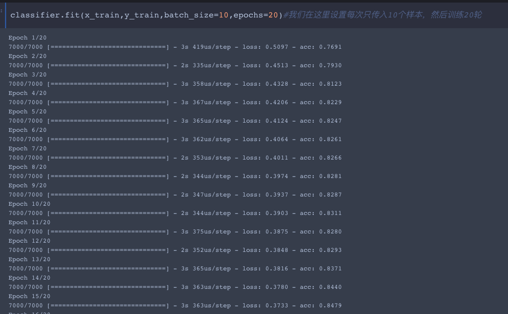

# 模型在测试集上面的表现

训练好的模型，我们在测试集上看一下效果。

```python
from sklearn.metrics import confusion_matrix as cm#我们用混淆矩阵查看下二分类的正误结果
y_pred=classifier.predict_classes(X_test)
cm(y_test,y_pred)
```

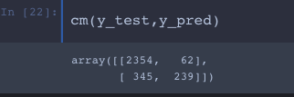

对角线上面是预测正确的结果，我们计算一下正确率

由于y_pred是以下这种格式：

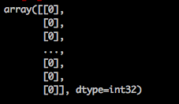

而y_test是这种格式：

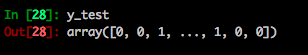

因此我们需要先打平y_pred，可以用reshape的方法，然后转换之后与y_test比较。

```python
y_pred=y_pred.reshape((-1,))
accuracies=(y_pred==y_test).sum()/float(len(y_test))
print (accuracies)
```

最后返回结果是0.824。说明在这个测试集上面的验证效果与训练集上面的比较起来差不多，也是相同的水平。

# 模型验证——方差和偏差的平衡

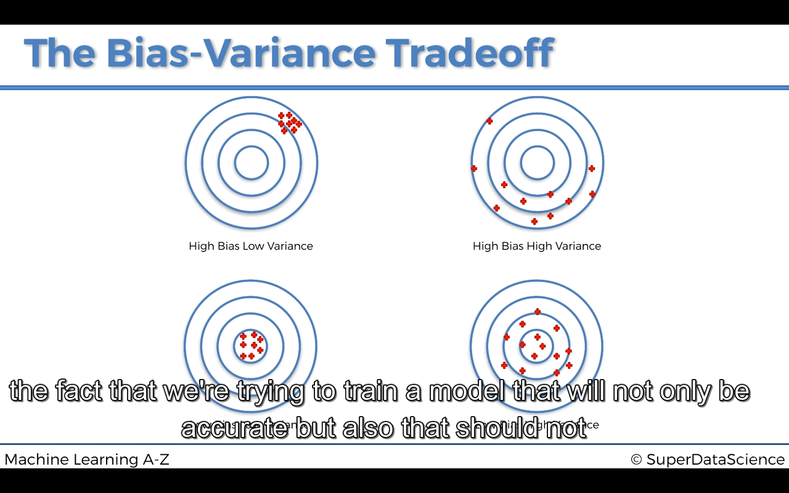 
方差和偏差的取舍，偏差是指与正确值的偏离程度，方差是每次训练的准确率差异的程度。
我们希望保持有低的偏差，同时每次训练的准确率不要变化太大。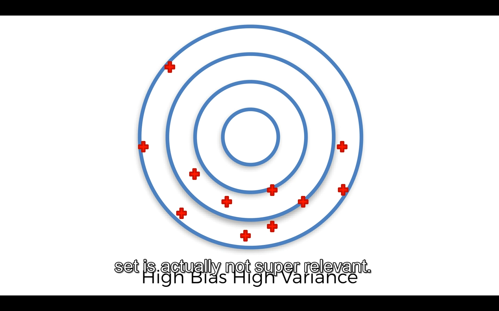 
对于不同的测试集，同一个模型会有不同的准确率，因为有方差的问题，所以用一个测试集的准确率来说事不合适。我们希望能够在多个测试集上面得出准确率的大小，并且能够对所有的准确率求方差，看一下稳定性。

## 交叉验证 
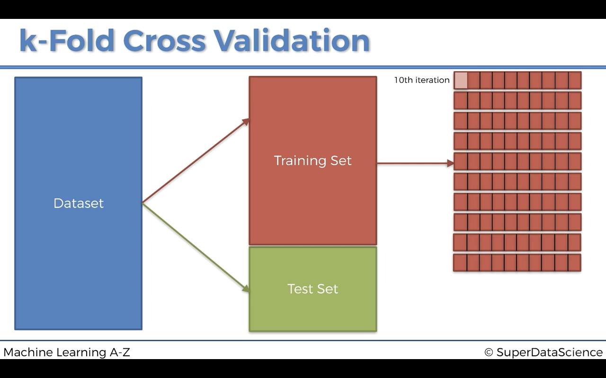 
通过交叉验证可以求出10次交叉的平均值，以及准确率的方差，因此我们就知道模型对于不同的测试集的偏差和方差情况是属于以上哪一种。

k折交叉验证一般是机器学习工具包sklearn里面的内容，我们可以用`keras.wrappers.scikit_learn`中的`KerasClassifier`来对训练模型打包后，将整个模型放到`sklearn.metrics.cross_val_score`计算交叉验证分数。

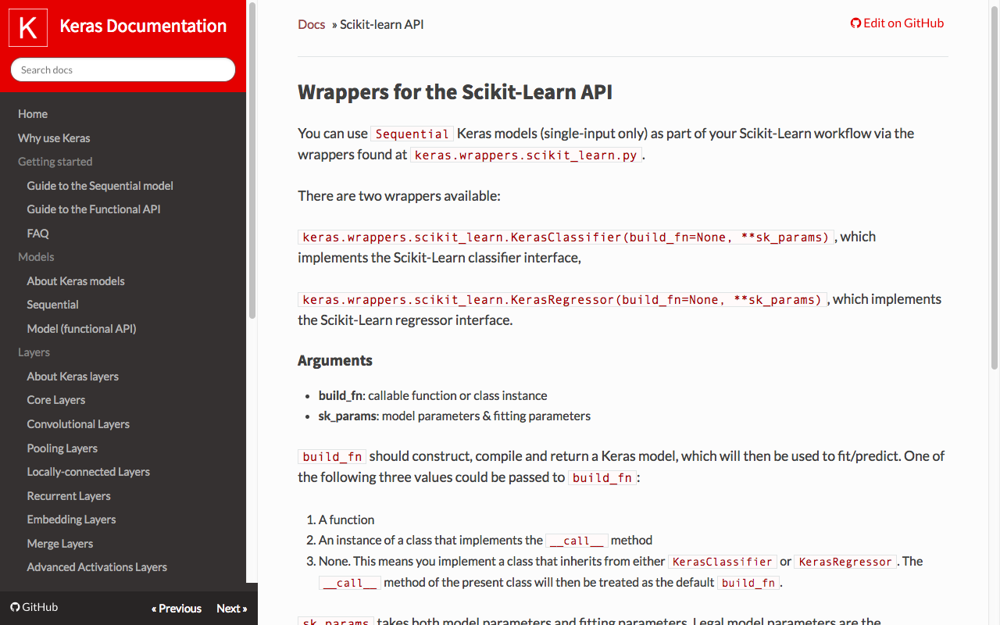

我们看一下`keras.wrappers.scikit_learn`这个工具包里面，可以用两个wrappers，一个是分类器，另外一个是回归。里面传入两个参数，一个是build_fn，里面传入一个用函数写好并编译好的返回的模型；sk_params传入拟合时候的参数，包括epochs和batch_size。

cross_val_score

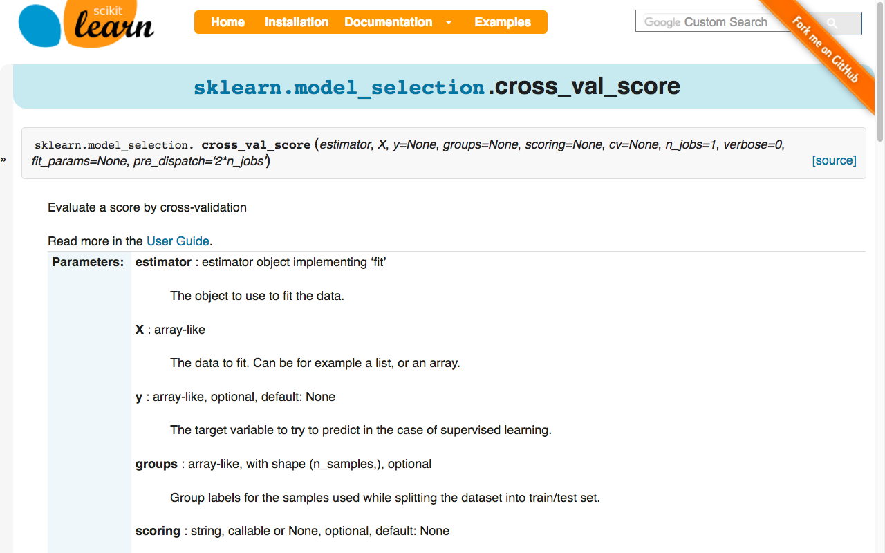

里面有几个参数比较重要，一个是esimator，也就是用来训练数据的分类器，X和y，scoring就是评价模型性能的标准，一般选择'accuracy'，cv就是交叉验证的折数，这里选择10.

```python
from keras.wrappers.scikit_learn import KerasClassifier
from sklearn.metrics import cross_val_score
#我们照抄上面的代码
def build_model():
    classifier=Sequential()
	classifier.add(Dense(units=6, input_shape=(11,),activation='relu',kernel_initializer='glorot_uniform',use_bias=True))
	classifier.add(Dropout(p=0.1))
    	classifier.add(Dense(units=6,activation='relu',kernel_initializer='glorot_uniform',use_bias=True))
	classifier.add(Dropout(p=0.1))
classifier.add(Dense(units=1,activation='sigmoid',kernel_initializer='glorot_uniform',use_bias=True))
	classifier.compile(loss='binary_crossentropy',optimizer='adam', metrics=['accuracy'])
    return classifier

classifier=KerasClassifier(build_fn=build_model,batch_size=10, epochs=20)
accuracies=cross_val_score(estimator=classifier, X=X_train, y=y_train,scoring='accuracy', cv=10, n_jobs=-1)
```

# 通过GridSearchCV来寻找最优参数

同样，我们在这里也可以把keras wrapper好的模型来传入sklearn的gridsearchcv来寻找最优参数。

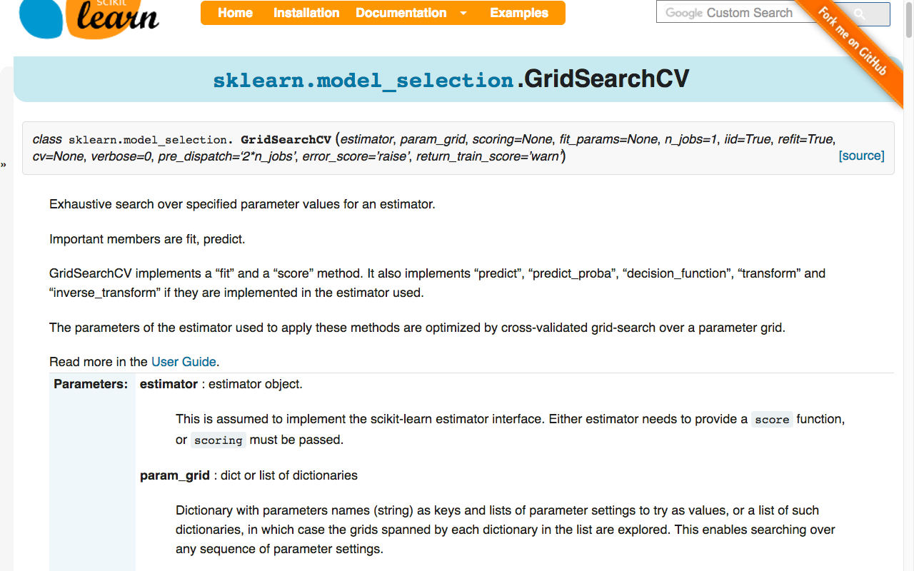

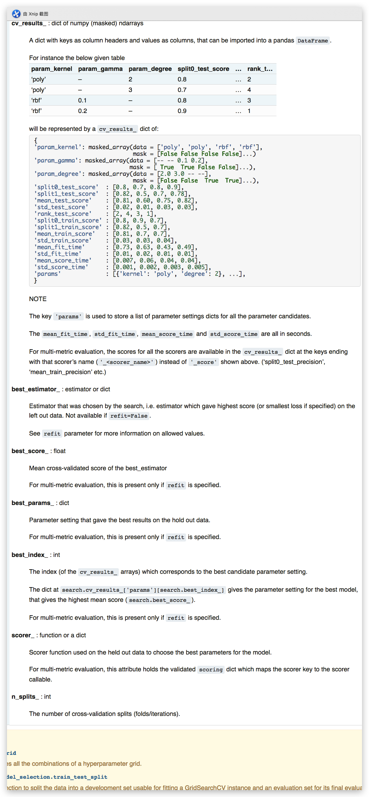

gridsearchcv有几个返回值是十分重要的，包括best_estimator_还有best_score_

```python
from sklearn.model_selection import GridSearchCV
#在这里定义的optimizer作为函数的参数，它可以在GridSearchCV当中被识别为被调优的参数
def build_classifier(optimizer):
    classifier=Sequential()
    classifier.add(Dense(6,input_shape=(11,), activation='relu',kernel_initializer='glorot_uniform',use_bias=True))
    classifier.add(Dropout(rate=0.1))
    classifier.add(Dense(6, activation='relu',kernel_initializer='glorot_uniform',use_bias=True))
    classifier.add(Dropout(rate=0.1))
    classifier.add(Dense(1,kernel_initializer='glorot_uniform',activation='sigmoid'))
    classifier.compile(loss='binary_crossentropy', optimizer=optimizer,metrics=['accuracy'])
    return classifier
classifier=KerasClassifier(build_fn=build_model)
params={'epochs':[10,20],
       'batch_size':[10,20],
       'optimizer':['adam', 'sgd']}#用字典定义参数

gridsearch=GridSearchCV(estimator=classifier,param_grid=params, scoring='accuracy', n_jobs=-1, cv=10)
gridsearch.fit(X_train, y_train)
print (gridsearch.best_estimator)
print (gridsearch.best_score_)
```

